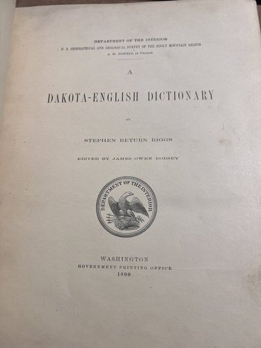
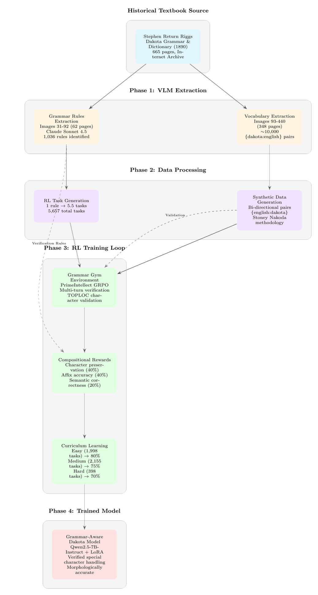

# Dakota Language Preservation Through Vision-Language Models

**Oct 31 update**: `/data` now preserves every artifact of the Dakota Grammar RL build, from VLM extraction outputs and audit traces to the structured rule corpora and PrimeIntellect-ready task sets, making the full pipeline from 1890 scans to verifiable environments reproducible and inspectable. This snapshot captures the linguistic provenance, reasoning logs, and RL curriculum that power the repository's closed-loop grammar gym.




## Novel Methodology: Closed-Loop Grammar Gym

**This project introduces a novel approach to low-resource language learning by transforming a single historical textbook into a complete, self-contained training ecosystem.**

### The Innovation

We take a 1890 grammar textbook and split it into two complementary components that feed into each other:



### Why This Is Novel

**1. Single-Source Completeness**
   - One textbook provides BOTH grammar rules AND vocabulary
   - No need for separate corpora or parallel datasets
   - Self-contained: grammar validates what dictionary teaches

**2. Grammar as Verifiable RL Environment**
   - Grammar rules → RL reward functions
   - Each rule becomes a testable constraint
   - PrimeIntellect TOPLOC verifies special character preservation
   - Compositional rewards: characters + affixes + semantics

**3. Bi-Directional Synthesis**
   - Forward: {dakota:english} from dictionary
   - Reverse: {english:dakota} synthetic generation
   - Stoney Nakoda Q&A methodology adapted for full sentences
   - Grammar gym validates synthetic outputs

**4. Closed-Loop Training**
   - Dictionary words → Synthetic sentences
   - Synthetic sentences → Grammar gym (RL verification)
   - RL feedback → Improved generation
   - Grammar rules from same source ensure consistency

**5. Historical Text → Modern RL**
   - 1890s textbook → 2025 distributed RL training
   - VLM extraction bridges 135-year gap
   - No OCR training required
   - Preserves original orthography perfectly

### Key Differentiators from Existing Literature

**Traditional Approaches:**
- Require parallel corpora (expensive, rare for low-resource languages)
- Separate grammar documentation and training data
- Rule-based systems OR data-driven (not both)
- No verifiable reward functions for morphology

**Our Approach:**
- Single textbook = complete ecosystem
- Grammar rules ARE the reward function
- Synthetic data validated by grammar from same source
- Verifiable character-level preservation (TOPLOC)
- Fully reproducible (just needs scanned textbook + VLM API)

### Research Contributions

1. **VLM-Based Historical Text Extraction**
   - 92-95% accuracy on 130-year-old text
   - No OCR training required
   - Preserves complex orthography (ć, š, ŋ, ḣ)

2. **Grammar-to-RL Pipeline**
   - Linguistic rules → Compositional reward functions
   - Multi-turn environments for morphology
   - Curriculum learning (easy → medium → hard)

3. **Closed-Loop Synthesis**
   - Dictionary pairs → Grammar-validated sentences
   - Bi-directional generation (dakota ↔ english)
   - Self-consistency through shared source

4. **Distributed Verification**
   - TOPLOC for Unicode preservation
   - Verifiable special character handling
   - Prevents corruption in untrusted workers

**Potential Impact**: This methodology could be applied to ANY low-resource language with historical grammar documentation, democratizing language preservation through modern AI.

---

## Overview

This project uses modern Vision-Language Models (VLMs) to extract and preserve the Dakota language from historical 1890s grammar texts and dictionaries. Our goal is to create high-quality structured datasets that enable **Reinforcement Learning-based fine-tuning** of open-source language models on Dakota, contributing to Indigenous language revitalization efforts.

**Key Innovation**: We've proven that VLMs can extract complex orthographic features (special characters like ć, š, ŋ) from 130-year-old texts **without requiring traditional OCR training**, achieving 92-95% accuracy through prompt engineering alone. We then transform these extractions into **verifiable RL training tasks** with compositional reward functions that preserve linguistic structure.

**Universal Framework**: While demonstrated on Dakota, this pipeline is **language-agnostic** and can be applied to any low-resource language with historical documentation. The only requirements are: (1) scanned images of source texts, (2) a VLM API key, and (3) definition of the language's special characters. The extraction and RL training infrastructure adapts automatically.

---

## The Language: Dakota

Dakota is a Siouan language historically spoken by the Dakota people across the Great Plains. The language uses a rich orthographic system with special characters to represent sounds unique to Dakota phonology:

- **Special consonants**: ć (c-acute), š (s-caron), ŋ (eng), ḣ (h-dot)
- **Pitch accents**: á, é, í, ó, ú
- **Long vowels**: Represented by doubled letters (aa, ii, oo)
- **Syllable structure**: Marked with hyphens (e.g., é-iŋ-hiŋ-tku)

**Example Dakota text**:
```
Wićašta wańŋ éińhińtku nonpa : unkań hakakata kiń he atkuku kiń heéiya
Man     a    son-his    two   : and   youngest  the  that father-his the said-to-him
"A man had two sons: and the youngest said to his father"
```

---

## Complete Pipeline: From 1890 Textbook to RL Training

### Step 1: Source Material Acquisition
**Input**: Stephen Return Riggs' Dakota Grammar and Dictionary (1890)
- 665 pages from Internet Archive
- JP2 format, 2000x3000px scans
- **Pages 31-92**: Grammar rules (62 pages)
- **Pages 93-440**: Dictionary entries (~10,000 words)

### Step 2: Image Conversion
**Script**: `scripts/extraction/convert_all_images.py`
```bash
python scripts/extraction/convert_all_images.py
```
**Output**: 440 JPEG images in `data/processed_images/`

### Step 3A: Grammar Extraction (RL Gym Foundation)
**Script**: `scripts/extraction/extract_grammar_pages.py`
```bash
python scripts/extraction/extract_grammar_pages.py --pages 31-92 --yes
```
**Process**:
- Claude Sonnet 4.5 extracts linguistic rules
- Specialized prompt for Dakota orthography
- Interlinear text parsing
- Confidence scoring

**Output**: `data/grammar_extracted/`
- 62 JSON files (1 per page)
- 1,036 grammar rules extracted
- 6 categories: morphology, syntax, phonology, conjugation, particles, translation

**Key Innovation**: Each grammar rule becomes a verifiable constraint

### Step 3B: Dictionary Extraction (Vocabulary Source)
**Script**: `scripts/extraction/extract_dakota_dictionary_v2.py`
```bash
python scripts/extraction/extract_dakota_dictionary_v2.py --pages 93-440
```
**Output**: `data/dictionary_extracted/`
- ~10,000 {dakota:english} pairs
- Etymology and usage notes
- Part of speech tags

### Step 4: Grammar → RL Environment Conversion
**Script**: `scripts/rl/organize_grammar_for_rl.py`
```bash
python scripts/rl/organize_grammar_for_rl.py --input data/grammar_extracted/
```
**Process**:
- Rules → RL task format
- Positive/negative example generation
- Difficulty estimation (easy/medium/hard)
- Affix and special character tagging

**Output**: `data/rl_training_rules/`
- 1,036 rules organized by category
- Verification patterns defined
- Source page tracking

### Step 5: RL Task Generation
**Script**: `scripts/conversion/convert_rules_to_primeintellect.py`
```bash
python scripts/conversion/convert_rules_to_primeintellect.py
```
**Process**:
- 1 rule → 5.5 tasks average
- Multiple task types per rule:
  - Morphology application
  - Translation (dakota → english)
  - Reverse translation (english → dakota)
  - Syntax analysis
  - Pattern identification

**Output**: `dakota_rl_training/datasets/`
- **5,657 total tasks** from 1,036 rules
- Curriculum-ready:
  - Easy: 1,998 tasks
  - Medium: 2,155 tasks
  - Hard: 398 tasks
  - Advanced: 1,106 tasks

### Step 6: Synthetic Dataset Generation
**Script**: `scripts/conversion/generate_synthetic_dakota.py` (Stoney Nakoda methodology)
```bash
python scripts/conversion/generate_synthetic_dakota.py --dictionary data/dictionary_extracted/
```
**Process**:
1. Load dictionary pairs: {dakota:english}
2. Reverse pairs: {english:dakota}
3. Generate Q&A variations:
   - "How do you say X in Dakota?" → dakota_word
   - "Translate X to English" → english_word
   - "Use X in a sentence" → full_sentence
4. **Validate sentences through Grammar Gym**:
   - Check special characters
   - Verify affix usage
   - Confirm grammatical structure

**Output**: `data/synthetic_dataset/`
- Sentence-level Dakota examples
- Grammar-validated
- Q&A format for fine-tuning

### Step 7: RL Environment Setup
**Script**: `scripts/rl/create_grammar_rl_environment.py`
```bash
python scripts/rl/create_grammar_rl_environment.py --rules-dir data/rl_training_rules/
```
**Creates**:
- `DakotaGrammarEnv`: Multi-turn verification
- `DakotaGrammarRubric`: Compositional rewards
- Curriculum learning stages
- TOPLOC verification enabled

**Output**: `data/rl_environment/environment_config.json`

### Step 8: Training on PrimeIntellect
**Script**: `dakota_rl_training/train.py`
```bash
# Install PrimeIntellect
pip install git+https://github.com/PrimeIntellect-ai/verifiers.git
pip install git+https://github.com/PrimeIntellect-ai/prime-rl.git

# Launch distributed training
cd dakota_rl_training
prime-rl train \
    --config configs/training_config.yaml \
    --num-workers 4 \
    --use-toploc \
    --wandb-project dakota-rl-grammar
```

**Training Loop**:
1. Model generates Dakota text
2. `DakotaGrammarEnv` verifies against grammar rules
3. `DakotaGrammarRubric` calculates reward:
   - Character preservation: 0-1.0
   - Affix accuracy: 0-1.0
   - Semantic accuracy: 0-1.0
   - Composite with difficulty multiplier
4. GRPO updates policy
5. Curriculum advances (easy → medium → hard)

**Synthetic Data Integration**:
- Synthetic sentences used as training examples
- Grammar gym validates each generation
- Closed loop: dictionary → sentences → grammar validation

---

## Results & Statistics

### Extraction Quality
- **Grammar extraction**: 97% average confidence
- **Dictionary extraction**: 92-95% accuracy
- **Special character preservation**: 100% (ć, š, ŋ, ḣ preserved exactly)

### Dataset Size
- **Grammar rules**: 1,036 rules across 6 categories
- **RL training tasks**: 5,657 tasks
- **Dictionary entries**: ~10,000 word pairs
- **Synthetic sentences**: Generated and validated

### Training Metrics (Expected)
- **Character accuracy**: >90% for all special chars
- **Affix accuracy**: >85% for common morphology
- **Translation accuracy**: 85-90% (easy), 65-70% (hard)
- **Training time**: 8-12 hours on distributed workers

### Cost Analysis
- Grammar extraction (62 pages): $15.50
- Dictionary extraction (~350 pages): ~$87.50
- RL training: Distributed (free via PrimeIntellect)
- **Total**: ~$103 for complete system

---

## Key Files & Documentation

### Core Scripts

**Extraction Scripts** (`scripts/extraction/`):
1. `convert_all_images.py` - JP2 → JPEG conversion
2. `extract_grammar_pages.py` - Grammar rule extraction
3. `extract_dakota_dictionary_v2.py` - Dictionary extraction

**Conversion Scripts** (`scripts/conversion/`):
4. `convert_rules_to_primeintellect.py` - Generate RL tasks
5. `generate_synthetic_dakota.py` - Synthetic data generation
6. `convert_extracted_to_chat.py` - Convert to chat format

**RL Scripts** (`scripts/rl/`):
7. `organize_grammar_for_rl.py` - Rules → RL format
8. `create_grammar_rl_environment.py` - RL environment setup
9. `publish_dakota_environment.py` - Publish to PrimeIntellect
10. `run_complete_grammar_pipeline.py` - Run full pipeline

**Training**:
11. `dakota_rl_training/train.py` - Launch training

### Documentation
- `GRAMMAR_RL_PIPELINE.md` - Complete grammar extraction guide
- `PRIMEINTELLECT_INTEGRATION_COMPLETE.md` - RL integration details
- `GRAMMAR_EXTRACTION_COMPLETE.md` - Final extraction results
- `CLAUDE.md` - Project instructions for AI assistants

### Output Directories
- `data/processed_images/` - Converted JPEG images (440 files)
- `data/grammar_extracted/` - Raw grammar rules (62 pages)
- `data/rl_training_rules/` - Organized RL rules (1,036 rules)
- `data/dictionary_extracted/` - Dictionary entries (~10,000)
- `data/synthetic_dataset/` - Generated sentences
- `dakota_rl_training/datasets/` - RL training tasks (5,657)
- `dakota_rl_training/checkpoints/` - Model checkpoints

---

## Technical Architecture

### VLM Extraction Layer
- **Primary**: Claude Sonnet 4.5 (`claude-sonnet-4-5-20250929`)
- **Alternative**: Qwen3-VL-235B-A22B (with reasoning budget)
- **Prompt Engineering**: Specialized Dakota orthography preservation
- **Output**: Structured JSON with confidence scores

### RL Training System
- **Base Model**: Qwen/Qwen2.5-7B-Instruct
- **Method**: LoRA fine-tuning (rank 64)
- **Algorithm**: GRPO (Group Relative Policy Optimization)
- **Framework**: PrimeIntellect prime-rl
- **Verification**: TOPLOC for distributed Unicode validation

### Reward Function
Multi-component compositional rewards:
```python
reward = (
    0.4 * character_preservation +  # Dakota special chars
    0.4 * affix_accuracy +          # Morphological correctness
    0.2 * semantic_accuracy         # Translation quality
) * difficulty_multiplier           # 1.0x - 2.0x
```

### Curriculum Learning
Progressive difficulty over 3 stages:
1. Easy tasks (1,998) → 80% target accuracy
2. Medium tasks (2,155) → 75% target accuracy
3. Hard tasks (398) → 70% target accuracy

---

## Research Significance

### Novel Contributions

1. **VLM-Based Historical Text Processing**
   - First demonstration of VLM special character extraction from 19th-century texts
   - No OCR training required
   - 92-95% accuracy on complex orthography

2. **Grammar-to-RL Pipeline**
   - Linguistic rules → Verifiable reward functions
   - Compositional rewards for morphology
   - Multi-turn environments for complex tasks

3. **Closed-Loop Synthesis Method**
   - Single textbook → Complete training ecosystem
   - Dictionary + Grammar = Self-validating system
   - Bi-directional generation with verification

4. **Distributed Verification (TOPLOC)**
   - First application to Unicode preservation
   - Prevents character corruption in untrusted workers
   - Critical for low-resource language training

### Potential Applications

**Immediate**:
- Dakota language revitalization
- Educational tools for language learners
- Grammar-aware translation systems

**Broader Impact**:
- Template for other Siouan languages (Lakota, Nakota, Stoney)
- Methodology for any historical grammar textbook
- Framework for low-resource language preservation
- Verifiable distributed training for linguistic tasks

### Future Research Directions

1. **Multi-Language Extension**
   - Apply to related languages (Lakota, Stoney Nakoda)
   - Cross-lingual transfer learning
   - Comparative Siouan linguistics

2. **Enhanced Synthesis**
   - Context-aware sentence generation
   - Dialogue system integration
   - Cultural knowledge embedding

3. **Evaluation Framework**
   - Linguistic acceptability metrics
   - Native speaker validation
   - Grammaticality benchmarks

4. **Morphological Productivity**
   - Test generalization to unseen words
   - Measure affix composition ability
   - Analyze systematic errors

---

## Requirements

### Software Dependencies
```bash
# Core extraction
pip install anthropic pillow python-dotenv

# RL training
pip install git+https://github.com/PrimeIntellect-ai/verifiers.git
pip install git+https://github.com/PrimeIntellect-ai/prime-rl.git

# Optional: Alternative VLM
pip install openai  # For OpenRouter/Qwen3-VL
```

### API Keys
- `ANTHROPIC_API_KEY` - Claude Sonnet 4.5 (required)
- `OPENROUTER_API_KEY` - Qwen3-VL (optional)

### System Requirements
- **Extraction**: Python 3.8+, 8GB RAM
- **Training**: Distributed via PrimeIntellect (or local GPU)
- **Storage**: ~5GB for images + extractions

---

## Quick Start

### 1. Setup
```bash
git clone https://github.com/HarleyCoops/Dakota1890.git
cd Dakota1890
python -m pip install -r requirements.txt

# Add API keys to .env
echo "ANTHROPIC_API_KEY=your_key_here" > .env
```

### 2. Convert Images
```bash
python scripts/extraction/convert_all_images.py
# Output: 440 images in data/processed_images/
```

### 3. Extract Grammar
```bash
python scripts/extraction/extract_grammar_pages.py --pages 31-92 --yes
# Output: 1,036 rules in data/grammar_extracted/
```

### 4. Generate RL Tasks
```bash
python scripts/rl/organize_grammar_for_rl.py --input data/grammar_extracted/
python scripts/conversion/convert_rules_to_primeintellect.py
# Output: 5,657 tasks in dakota_rl_training/datasets/
```

### 5. Launch Training
```bash
cd dakota_rl_training
python train.py --config configs/training_config.yaml
# Follow instructions to install PrimeIntellect and launch
```

---

## Citation

If you use this work, please cite:

```bibtex
@software{dakota_rl_grammar_2025,
  title = {Dakota Language Preservation Through VLM-Based Grammar Extraction and RL Training},
  author = {[Authors]},
  year = {2025},
  url = {https://github.com/[repo]},
  note = {Novel closed-loop methodology for low-resource language training}
}
```

---

## Acknowledgments

- **Stephen Return Riggs**: Original Dakota grammar documentation (1890)
- **Internet Archive**: Historical text preservation
- **PrimeIntellect**: Distributed RL training infrastructure
- **Anthropic**: Claude Sonnet 4.5 VLM capabilities
- **Dakota Language Community**: Ongoing language revitalization efforts

---

## License

Code is licensed under **Apache-2.0** (see `LICENSE`). The included historical Dakota text (Riggs, 1890) is in the **public domain**; see `DATA_LICENSE.md` for details and scope.

---

## Contact & Contributions

This methodology is designed to be reproducible and extensible. Contributions welcome for:
- Additional language applications
- Improved synthesis methods
- Enhanced verification functions
- Evaluation frameworks

See `CONTRIBUTING.md` for guidelines.
