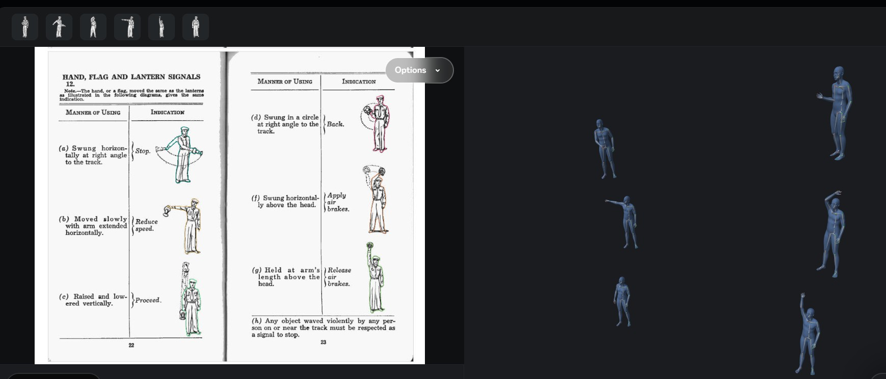

# Qwen3-RailroadEngineer1959-RL



## Overview

**Qwen3-RailroadEngineer1959-RL** is a state-of-the-art neuro-symbolic project that translates the visual and procedural logic of the 1959 Railroad Instruction Manual into reinforcement learning reward functions. 

This repository has been completely re-architected to leverage the cutting-edge **Gemini 3 Pro** model (`gemini-3-pro-preview`) for all linguistic and multimodal reasoning, coupled with **SAM 3D** for precise visual segmentation and reconstruction.

## The Architecture: Gemini 3 Pro + SAM 3D

This project abandons legacy extraction methods in favor of a two-model pipeline:

### 1. 3D Reconstruction: SAM 3D Objects
We use **Meta's SAM 3D** to lift 2D images into 3D.
*   **Model**: `SAM 3D Objects`
*   **Role**: "The Visual Cortex"
*   **Function**: Decomposes masked 2D signal diagrams into 3D point clouds and meshes, allowing the system to understand "depth" (e.g., a semaphore arm angle relative to the mast).

### 2. Semantic Reasoning: Gemini 3 Pro
We use **Google's Gemini 3 Pro** (`gemini-3-pro-preview`) as the exclusive cognitive engine.
*   **Role**: "The Brain"
*   **Function**: 
    *   Takes the raw rulebook pages and SAM 3D reconstructions.
    *   Generates precise "Composite Signal Functions" (e.g., mapping a visual aspect to a procedural constraint).
    *   Translates 1959 operational text into formal logic for RL.

## The Pipeline

The `pipeline.py` script orchestrates this interaction:

1.  **Input**: A raw image (e.g., a signal diagram) is loaded.
2.  **SAM 3D Reconstruction**: The image is passed to SAM 3D (along with a mask) to generate a `.ply` 3D reconstruction.
3.  **Gemini 3 Pro Analysis**: The original image and context are fed into Gemini 3 Pro with the prompt:
    > "Analyze this image... define the 'Indication' and 'Name' of this signal, and write the corresponding Operating Rule as a conditional statement."
4.  **Output**: A structured, verifiable rule.

## Installation

1.  Clone the repository.
2.  Install dependencies:
    ```bash
    pip install -r requirements.txt
    ```
3.  **Model Setup**:
    *   **SAM 3D**: Ensure `sam-3d-objects` checkpoints are in `sam-3d-objects/checkpoints/hf/`.

## Usage

1.  Set your Google API Key:
    ```bash
    export GOOGLE_API_KEY="your_gemini_key"
    ```
2.  Run the pipeline:
    ```bash
    python pipeline.py
    ```

## Relation to Dakota1890

This project builds upon the methodology of [Dakota1890](https://github.com/HarleyCoops/Dakota1890), moving from **linguistic morphology** (Dakota language) to **visual-procedural morphology** (Railroad signals). Where Dakota used Claude/Qwen, RailroadEngineer standardizes on **Gemini 3 Pro** for its next-generation reasoning capabilities.

## License

Apache 2.0
